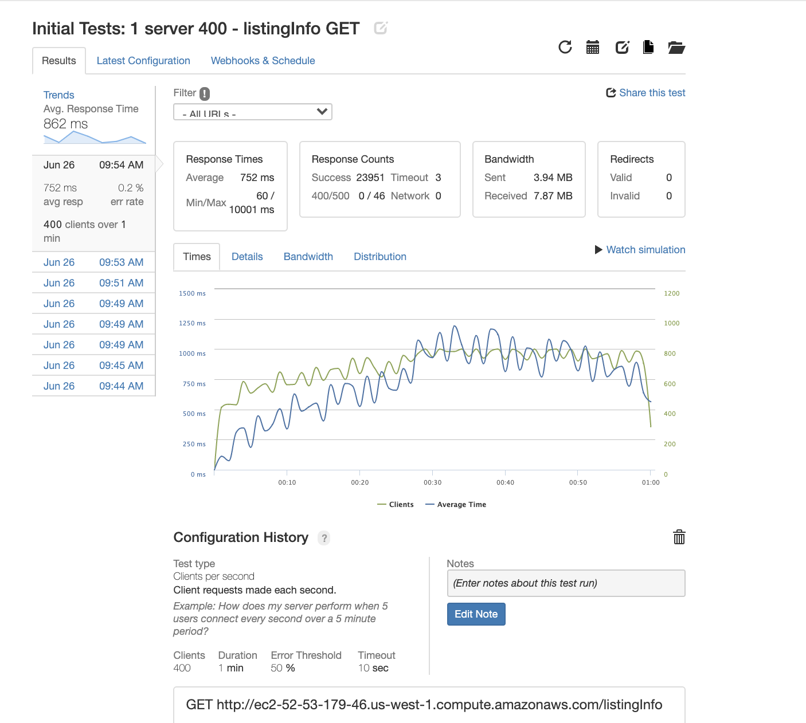
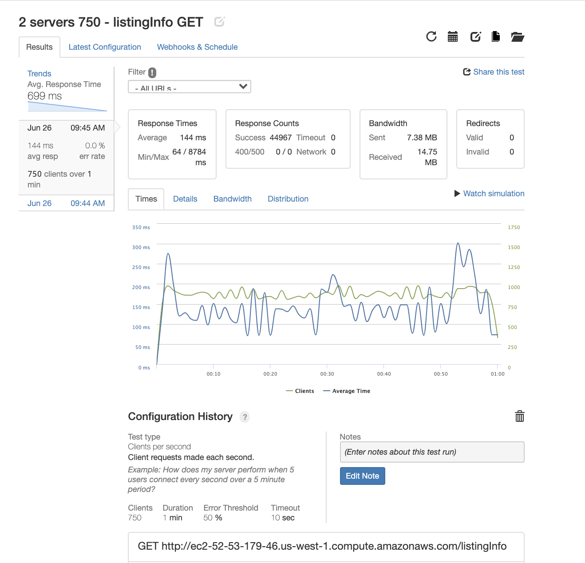
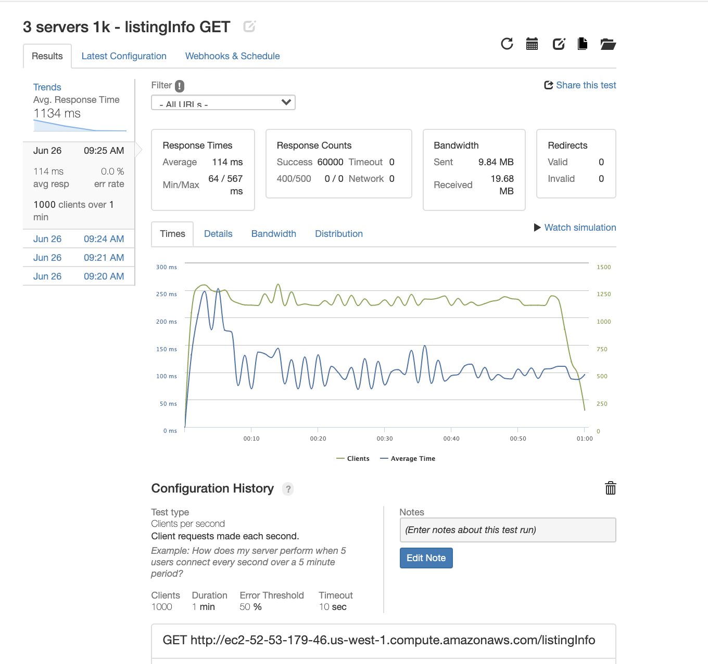
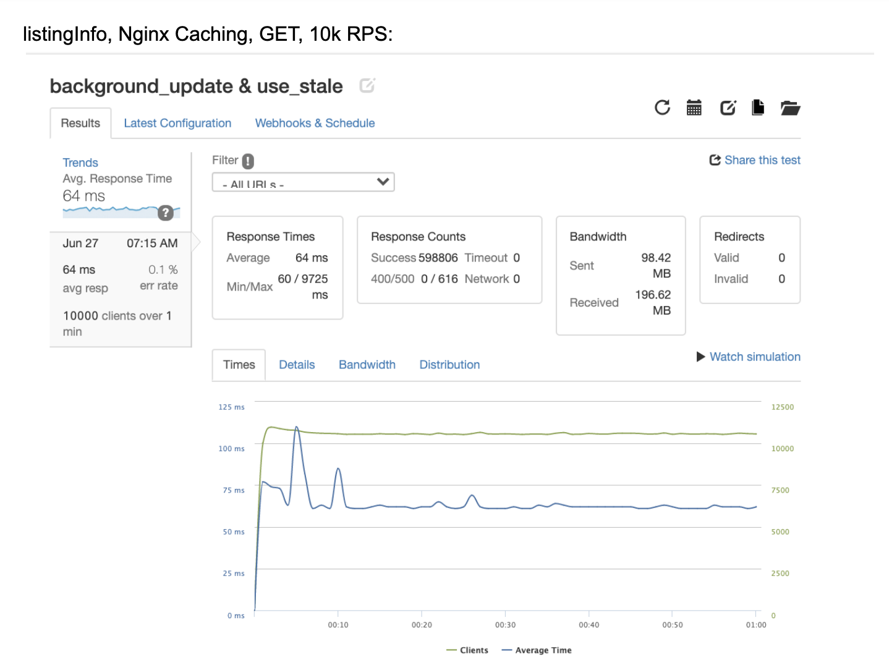

# Jason's SDC Journal

## Table of Contents

1. [Phase 1: Scale the Database](#Phase-1-Scale-the-Database)
    - [Support CRUD from your API](#Support-CRUD-from-your-API)
    - [Selection and Data Generation](#DBMS-Selection-and-Data-Generation)
    - [DBMS Benchmarking](#DBMS-Benchmarking)
2. [Phase 2: Measure Initial Performance](#Phase-2-Measure-Initial-Performance)
    - [Test Configs](#Test-Configs)
    - [Helper Function](#Helper-Function)
    - [Pre-Redis-Results](#Pre-Redis-Results)
    - [Post-Redis-Results](#Post-Redis-Results)
3. [Phase 3: Deploy the Service and Proxy](#Phase-3-Deploy-the-Service-and-Proxy)
    - [Deploying Service and Proxy through EC2 Ubuntu Instances](#Deploying-Service-and-Proxy-through-EC2-Ubuntu-Instances)
    - [Remote MongoDB Server Deployment](#Remote-MongoDB-Server-Deployment)
        - [Set Up Server](#Set-Up-Server)
        - [Configure Security](#Configure-Security)
    - [Create and Seed DB and Collections](#Create-and-Seed-DB-and-Collections)
4. [Phase 4: Scale the Service and Proxy](#Phase-4-Scale-the-Service-and-Proxy)
    - [Add Nginx As Load Balancer and Duplicate App Server](#Add-Nginx-As-Load-Balancer-and-Duplicate-App-Server)
        - [Second Server](#Second-Server)
        - [Third Server](#Third-Server)
        - [Fourth Server](#Fourth-Server)
        - [Implement Redis Caching For All Servers](#Implement-Redis-Caching-For-All-Servers)
    - [Nginx Microcaching](#Nginx-Microcaching)
        - [Nginx Configs](#Nginx-Configs)
        - [Post Nginx Microcaching Results](#Post-Nginx-Microcaching-Results)
    - [All Loader IO Test Results](#All-Loader-IO-Test-Results)

## Phase 1: Scale the Database

### Support CRUD from your API
> I created PUT and DELETE routes in order to make my api truly RESTful. The PUT route allows changes to be made to any listingId and the DELETE route allows for the specified listingId to be deleted.

### DBMS Selection and Data Generation
> I will create and seed two db's, PostgreSQL and MongoDB. I will then test each to determine which db to use.
> Creating CSV files is optimal for my specific use case as I can seed both databases with the same files once they are created.

#### Postgres
I will use Postgres as my SQL DBMS.

#### MongoDB
I will use MongoDB as my NoSQL Database.

## Data Generation

Generated CSV file for listingitems table and bookings table.

For MongoDB I used these shell commands to import the csv files into the db:

* mongoimport --type csv -d reservation_service -c listingitems --headerline --drop listingInfoCSV
* mongoimport --type csv -d reservation_service -c bookings --headerline --drop bookingsInfoCSV

For PostgresQL I used this shell command to import the csv files into the db using the script in my schema.sql file:

* psql -f schema.sql -U jasonjacob reservation_service

## DBMS Benchmarking

### MongoDB Testing log:

##### - - listingitems Collection tests - -

Test 1 - “Initial Test”:

Query: db.listingitems.find({id: 9000000}).explain('executionStats');

Results: "executionStats" : {
                "executionSuccess" : true,
                "nReturned" : 1,
                **"executionTimeMillis" : 12843**,
                "totalKeysExamined" : 0,
                "totalDocsExamined" : 10000000  "docsExamined" : 10000000
                }

++++++++++++++++++++++++++++++++++++++++++++++++++++++++++++

Ran this test again after running “Second Test” and getting a faster result, and got a quicker result for this test as well:

Query: db.listingitems.find({id: 9000000}).explain('executionStats');

Results:"executionStats" : {
                "executionSuccess" : true,
                "nReturned" : 1,
                **"executionTimeMillis" : 3576**,
                "totalKeysExamined" : 0,
                "totalDocsExamined" : 10000000
		}

++++++++++++++++++++++++++++++++++++++++++++++++++++++++++++

Test 2 - “Second Test”:

Query: db.listingitems.find({id: 10000000}).explain('executionStats');

Results: "executionStats" : {
                "executionSuccess" : true,
                "nReturned" : 1,
                **"executionTimeMillis" : 3750**,
                "totalKeysExamined" : 0,
                "totalDocsExamined" : 10000000
		}

##### - - bookings Collection tests - -

Test 1 - “Initial Test”:

Query: db.bookings.find({listingId: 9000000}).explain('executionStats');

Results: "executionStats" : {
                "executionSuccess" : true,
                "nReturned" : 6,
                **"executionTimeMillis" : 61225**,
                "totalKeysExamined" : 0,
                "totalDocsExamined" : 60000000
		}

Test 2 - “Second Test”:

Query: db.bookings.find({listingId: 10000000}).explain('executionStats');

Results: "executionStats" : {
                "executionSuccess" : true,
                "nReturned" : 1,
                **"executionTimeMillis" : 57233**,
                "totalKeysExamined" : 0,
                "totalDocsExamined" : 10000000
		}

===================================================================================

#### Initial Results did not meet the 50 millisecond requirement. Implemented indexing in order to improve queries…

===================================================================================

###### - - listingitems Collection tests - -

Implemented indexing on listingitems Collection in MongoDB shell using:  “db.listingitems.createIndex( { id: 1 } );”

Test 1 - “Post-Indexing Test 1”:

Query: db.listingitems.find({id: 9000000}).explain('executionStats');

Results: "executionStats" : {
                "executionSuccess" : true,
                "nReturned" : 1,
                **"executionTimeMillis" : 14**,
                "totalKeysExamined" : 1,
                "totalDocsExamined" : 1
		}

Test 2 - “Post-Indexing Test 2”:

Query: db.listingitems.find({id: 10000000}).explain('executionStats');

Results: "executionStats" : {
                "executionSuccess" : true,
                "nReturned" : 1,
                **"executionTimeMillis" : 6**,
                "totalKeysExamined" : 1,
                "totalDocsExamined" : 1
		}

###### - - bookings Collection tests - -

Implemented indexing on bookings Collection in MongoDB shell using:  “db.bookings.createIndex( { listingId: 1 } );”

Test 1 - “Post-Indexing Test 1”:

db.bookings.find({listingId: 9000000}).explain('executionStats') returned 0 milliseconds as the execution time, which obviously is not right. I believe was MongoDB is caching, so I changed queries and was able to get actual execution time results.

Query: db.bookings.find({listingId: 9550000}).explain('executionStats');

Results: "executionStats" : {
                "executionSuccess" : true,
                "nReturned" : 6,
                **"executionTimeMillis" : 2**,
                "totalKeysExamined" : 6,
                "totalDocsExamined" : 6
		}

Test 2 - “Post-Indexing Test 2”:

Query: db.bookings.find({listingId: 10000000}).explain('executionStats');

Results: "executionStats" : {
                "executionSuccess" : true,
                "nReturned" : 6,
                **"executionTimeMillis" : 9**,
                "totalKeysExamined" : 6,
                "totalDocsExamined" : 6
		}

===================================================================================

#### After indexing, all queries in the 90th percentile result in a lookup time of 14 milliseconds or less. This now meets application requirements. Moving on to benchmark PostgreSQL and optimize as needed…

===================================================================================

===================================================================================

===================================================================================

### PostgresQL Testing log:

##### - - listingitems Table tests - -

Test 1 - “Initial Test”:

Query: `EXPLAIN ANALYZE
	      SELECT * FROM listingitems WHERE id=9000000;`

Results:

#### QUERY PLAN:
- - - - - - - - - - - - - - - - - - - - - - - - - - - - - - - - - - - - - - - - - - - - - - - - - - - - - - - - - -
 Gather  (cost=1000.00..136417.85 rows=1 width=32) (actual time=727.822..808.605 rows=1 loops=1)
   Workers Planned: 2
   Workers Launched: 2
   ->  Parallel Seq Scan on listingitems  (cost=0.00..135417.75 rows=1 width=32) (actual time=770.809..797.319 rows=0 loops=3)
         Filter: (listingid = 9000000)
         Rows Removed by Filter: 3333333
 Planning Time: 0.111 ms
 Execution Time: 808.638 ms
(8 rows)
- - - - - - - - - - - - - - - - - - - - - - - - - - - - - - - - - - - - - - - - - - - - - - - - - - - - - - - - - -

Test 2 - “Second Test”:

Query: `EXPLAIN ANALYZE
	      SELECT * FROM listingitems WHERE id=10000000;`

Results:

#### QUERY PLAN:
- - - - - - - - - - - - - - - - - - - - - - - - - - - - - - - - - - - - - - - - - - - - - - - - - - - - - - - - - -
 Gather  (cost=1000.00..136417.85 rows=1 width=32) (actual time=818.507..819.749 rows=1 loops=1)
   Workers Planned: 2
   Workers Launched: 2
   ->  Parallel Seq Scan on listingitems  (cost=0.00..135417.75 rows=1 width=32) (actual time=812.185..812.185 rows=0 loops=3)
         Filter: (listingid = 10000000)
         Rows Removed by Filter: 3333333
 Planning Time: 0.092 ms
 Execution Time: 819.792 ms
(8 rows)
- - - - - - - - - - - - - - - - - - - - - - - - - - - - - - - - - - - - - - - - - - - - - - - - - - - - - - - - - -

#### - - bookings Table tests - -

Test 1 - “Initial Test”:

Query: `EXPLAIN ANALYZE
	      SELECT * FROM bookings WHERE listingId=8500000;`

Results:

#### QUERY PLAN:
- - - - - - - - - - - - - - - - - - - - - - - - - - - - - - - - - - - - - - - - - - - - - - - - - - - - - - - - - -
 Gather  (cost=1000.00..874257.20 rows=92 width=46) (actual time=11805.976..11807.188 rows=6 loops=1)
   Workers Planned: 2
   Workers Launched: 2
   ->  Parallel Seq Scan on bookings  (cost=0.00..873248.00 rows=38 width=46) (actual time=11288.712..11798.592 rows=2 loops=3)
         Filter: (listingid = 8500000)
         Rows Removed by Filter: 19999998
 Planning Time: 0.263 ms
 Execution Time: 11807.213 ms
(8 rows)
- - - - - - - - - - - - - - - - - - - - - - - - - - - - - - - - - - - - - - - - - - - - - - - - - - - - - - - - - -

Test 2 - “Second Test”:

Query: `EXPLAIN ANALYZE
	      SELECT * FROM bookings WHERE listingId=10000000;`

Results:

#### QUERY PLAN:
- - - - - - - - - - - - - - - - - - - - - - - - - - - - - - - - - - - - - - - - - - - - - - - - - - - - - - - - - -
 Gather  (cost=1000.00..874257.20 rows=92 width=46) (actual time=4399.989..4401.154 rows=6 loops=1)
   Workers Planned: 2
   Workers Launched: 2
   ->  Parallel Seq Scan on bookings  (cost=0.00..873248.00 rows=38 width=46) (actual time=4393.065..4393.068 rows=2 loops=3)
         Filter: (listingid = 10000000)
         Rows Removed by Filter: 19999998
 Planning Time: 0.102 ms
 Execution Time: 4401.188 ms
(8 rows)
- - - - - - - - - - - - - - - - - - - - - - - - - - - - - - - - - - - - - - - - - - - - - - - - - - - - - - - - - -

===================================================================================

#### Initial Results did not meet the 50 millisecond requirement. Implemented indexing in order to improve queries…

===================================================================================

#### - - listingitems Table tests - -

Implemented indexing on bookings Collection in postgresQL shell using:

“CREATE INDEX listingitems_id_index ON listingitems (id);”

Test 1 - “Post-Indexing Test 1”:

Query: `EXPLAIN ANALYZE
	      SELECT * FROM listingitems WHERE id=9000000;`

Results:

#### QUERY PLAN:
- - - - - - - - - - - - - - - - - - - - - - - - - - - - - - - - - - - - - - - - - - - - - - - - - - - - - - - - - -
 Index Scan using bookings_listingid_index on bookings  (cost=0.56..10.17 rows=92 width=46) (actual time=0.019..0.021 rows=6 loops=1)
   Index Cond: (listingid = 8500000)
 Planning Time: 0.083 ms
 Execution Time: 0.039 ms
(4 rows)
- - - - - - - - - - - - - - - - - - - - - - - - - - - - - - - - - - - - - - - - - - - - - - - - - - - - - - - - - -

Test 2 - “Post-Indexing Test 2”:

Query: `EXPLAIN ANALYZE
	      SELECT * FROM listingitems WHERE id=10000000;`

Results:

#### QUERY PLAN:
- - - - - - - - - - - - - - - - - - - - - - - - - - - - - - - - - - - - - - - - - - - - - - - - - - - - - - - - - -
 Index Scan using listingitems_id_index on listingitems  (cost=0.43..8.45 rows=1 width=32) (actual time=5.625..5.628 rows=1 loops=1)
   Index Cond: (id = 10000000)
 Planning Time: 0.119 ms
 Execution Time: 5.655 ms
(4 rows)
- - - - - - - - - - - - - - - - - - - - - - - - - - - - - - - - - - - - - - - - - - - - - - - - - - - - - - - - - -

#### - - bookings Table tests - -

Implemented indexing on bookings Collection in MongoDB shell using:  “db.bookings.createIndex( { listingId: 1 } );”

Test 1 - “Post-Indexing Test 1”:

Query: `EXPLAIN ANALYZE
	      SELECT * FROM bookings WHERE listingId=8500000;`

Results:

#### QUERY PLAN:
- - - - - - - - - - - - - - - - - - - - - - - - - - - - - - - - - - - - - - - - - - - - - - - - - - - - - - - - - -
 Index Scan using bookings_listingid_index on bookings  (cost=0.56..10.17 rows=92 width=46) (actual time=1.442..1.447 rows=6 loops=1)
   Index Cond: (listingid = 8500000)
 Planning Time: 0.401 ms
 Execution Time: 1.496 ms
(4 rows)
- - - - - - - - - - - - - - - - - - - - - - - - - - - - - - - - - - - - - - - - - - - - - - - - - - - - - - - - - -

Test 2 - “Post-Indexing Test 2”:

Query: `EXPLAIN ANALYZE
	      SELECT * FROM bookings WHERE listingId=10000000;`

Results:

#### QUERY PLAN:
- - - - - - - - - - - - - - - - - - - - - - - - - - - - - - - - - - - - - - - - - - - - - - - - - - - - - - - - - -
 Index Scan using bookings_listingid_index on bookings  (cost=0.56..10.17 rows=92 width=46) (actual time=0.024..0.028 rows=6 loops=1)
   Index Cond: (listingid = 10000000)
 Planning Time: 0.117 ms
 Execution Time: 0.056 ms
(4 rows)
- - - - - - - - - - - - - - - - - - - - - - - - - - - - - - - - - - - - - - - - - - - - - - - - - - - - - - - - - -

===================================================================================

#### After considering the pros and cons of each database, I decided MongoDB would be the best choice for my specific use case. Particularly, because Mongo has more flexibility in terms of document form. Less constraints on the data can be helpful in some cases, as opposed to Postgres, which is a SQL database and forces more structure than my use case probably needs. Also, sharding is less likely to be as complex with MongoDB as opposed to PostgresQL. Lastly, I won't need to use as much query power as a SQL database like Postgres would provide.

===================================================================================

## Phase 2: Measure Initial Performance

## Test Configs

config:
  target: 'http://localhost:3001'
  processor: './artilleryFunctions.js'
  phases:
    - duration: 15
      arrivalRate: 10
    - duration: 30
      arrivalRate: 100
      rampTo: 300
    - duration: 40
      arrivalRate: 300
      rampTo: 800
    - duration: 50
      arrivalRate: 800
      rampTo: 1200
    - duration: 60
      arrivalRate: 1200
      rampTo: 2000

scenarios:
   - name: 'GET listingInfo'
     flow:
       - function: 'artilleryContext'
       - get:
           url: '/listingInfo?listingId={{ listingId }}'
     - name: 'PUT listingInfo'
       flow:
         - function: 'artilleryContext'
         - put:
             url: '/listingInfo'
             json:
               id: "{{ listingId }}"
               listingId: "{{ listingId }}"
               pricePerNight: "{{ pricePerNight }}"
               weeked: "{{ weekend }}"
               weekendPrice: "{{ weekendPrice }}"
               maxGuests: "{{ maxGuests }}"
               tax: "{{ tax }}"
      - name: 'GET getBookedDates'
        flow:
          - function: 'artilleryContext'
          - get:
              url: '/getBookedDates?listingId={{ listingId }}'

## Helper Function

let listingId = 9500000;
let pricePerNight = 100;

const artilleryContext = (userContext, events, done) => {
  if (listingId > 9500200) {
    listingId = 9500000;
  }
  if (pricePerNight > 350) {
    pricePerNight = 100;
  }

  userContext.vars.listingId = listingId++;
  userContext.vars.pricePerNight = pricePerNight++;
  userContext.vars.weekend = listingId % 2 === 0 ? true : false;
  userContext.vars.weekendPrice = 1.1;
  userContext.vars.maxGuests = listingId > 9500150 ? 2 : listingId > 9500225 ? 4 : 3;
  userContext.vars.tax = 1.12;

  return done();
};

module.exports =  {
  artilleryContext
};

//// RAN ARTILLERY TESTS USING COMMAND "artillery run -o reportName.json artilleryTest.yml" ////

## Pre-Redis Results

#### getListingInfo:

"aggregate": {
    "timestamp": "2020-05-30T01:26:12.130Z",
    "scenariosCreated": 69566,
    "scenariosCompleted": 39796,
    "requestsCompleted": 39796,
    "latency": {
      "min": 2,
      "max": 141381.5,
      "median": 34390.5,
      "p95": 105573.8,
      "p99": 118047.2
    },
    "rps": {
      "count": 69566,
      **"mean": 191.45**
    },
    "scenarioDuration": {
      "min": 3.1,
      "max": 141394.1,
      "median": 34398.9,
      "p95": 105579.7,
      "p99": 118051.7
    },
    "scenarioCounts": {
      "GET listingInfo": 69566
    },
    "errors": {
      "ECONNRESET": 8844,
      "EADDRNOTAVAIL": 5987,
      "ETIMEDOUT": 3050,
      "ECONNREFUSED": 78,
      "ESOCKETTIMEDOUT": 11811
    },
    "codes": {
      "200": 39796
    },
    "matches": 0,
    "customStats": {},
    "counters": {},
    "scenariosAvoided": 0,
    "phases": [
      {
        "duration": 15,
        "arrivalRate": 10
      },
      {
        "duration": 30,
        "arrivalRate": 100,
        "rampTo": 300
      },
      {
        "duration": 60,
        "arrivalRate": 300,
        "rampTo": 600
      },
      {
        "duration": 60,
        "arrivalRate": 600
      }
    ]
  }

  #### updateListingInfo:

  "aggregate": {
    "timestamp": "2020-05-30T01:45:18.202Z",
    "scenariosCreated": 69285,
    "scenariosCompleted": 36480,
    "requestsCompleted": 36480,
    "latency": {
      "min": 2.1,
      "max": 150049.5,
      "median": 68596.6,
      "p95": 105316.6,
      "p99": 146886.4
    },
    "rps": {
      "count": 69285,
      **"mean": 164.1**
    },
    "scenarioDuration": {
      "min": 3.3,
      "max": 150051.7,
      "median": 68599.2,
      "p95": 105322.7,
      "p99": 146891.7
    },
    "scenarioCounts": {
      "PUT listingInfo": 69285
    },
    "errors": {
      "ECONNRESET": 6596,
      "EADDRNOTAVAIL": 8160,
      "ETIMEDOUT": 3451,
      "ECONNREFUSED": 52,
      "ESOCKETTIMEDOUT": 14545,
      "EPIPE": 1
    },
    "codes": {
      "200": 36480
    },
    "matches": 0,
    "customStats": {},
    "counters": {},
    "scenariosAvoided": 0,
    "phases": [
      {
        "duration": 15,
        "arrivalRate": 10
      },
      {
        "duration": 30,
        "arrivalRate": 100,
        "rampTo": 300
      },
      {
        "duration": 60,
        "arrivalRate": 300,
        "rampTo": 600
      },
      {
        "duration": 60,
        "arrivalRate": 600
      }
    ]
  }

  #### getBookedDates:

  "aggregate": {
    "timestamp": "2020-05-30T02:21:13.239Z",
    "scenariosCreated": 69264,
    "scenariosCompleted": 38357,
    "requestsCompleted": 38357,
    "latency": {
      "min": 2.3,
      "max": 183862.8,
      "median": 53029.1,
      "p95": 109323.3,
      "p99": 117459.6
    },
    "rps": {
      "count": 69264,
      **"mean": 183.51**
    },
    "scenarioDuration": {
      "min": 3.2,
      "max": 183865.5,
      "median": 53033.2,
      "p95": 109340.1,
      "p99": 117469.4
    },
    "scenarioCounts": {
      "GET getBookedDates": 69264
    },
    "errors": {
      "EADDRNOTAVAIL": 12748,
      "ECONNRESET": 5683,
      "ECONNREFUSED": 26,
      "ESOCKETTIMEDOUT": 12434,
      "ETIMEDOUT": 16
    },
    "codes": {
      "200": 38357
    },
    "matches": 0,
    "customStats": {},
    "counters": {},
    "scenariosAvoided": 0,
    "phases": [
      {
        "duration": 15,
        "arrivalRate": 10
      },
      {
        "duration": 30,
        "arrivalRate": 100,
        "rampTo": 300
      },
      {
        "duration": 60,
        "arrivalRate": 300,
        "rampTo": 600
      },
      {
        "duration": 60,
        "arrivalRate": 600
      }
    ]
  }

## Post-Redis Results

#### getListingInfo:

"aggregate": {
    "timestamp": "2020-05-31T02:14:58.807Z",
    "scenariosCreated": 113669,
    "scenariosCompleted": 112883,
    "requestsCompleted": 112883,
    "latency": {
      "min": 1.1,
      "max": 6691.2,
      "median": 12.1,
      "p95": 1560.5,
      "p99": 2350.5
    },
    "rps": {
      "count": 113669,
      **"mean": 325.55**
    },
    "scenarioDuration": {
      "min": 2.2,
      "max": 6694.8,
      "median": 17.8,
      "p95": 1565.8,
      "p99": 2356.1
    },
    "scenarioCounts": {
      "GET listingInfo": 113669
    },
    "errors": {
      "ECONNRESET": 540,
      "ECONNREFUSED": 246
    },
    "codes": {
      "200": 112883
    },
    "matches": 0,
    "customStats": {},
    "counters": {},
    "scenariosAvoided": 0,
    "phases": [
      {
        "duration": 15,
        "arrivalRate": 10
      },
      {
        "duration": 30,
        "arrivalRate": 100,
        "rampTo": 300
      },
      {
        "duration": 40,
        "arrivalRate": 300,
        "rampTo": 600
      },
      {
        "duration": 50,
        "arrivalRate": 600,
        "rampTo": 800
      },
      {
        "duration": 60,
        "arrivalRate": 800,
        "rampTo": 1000
      }
    ]
  }

#### getBookedDates:

"aggregate": {
    "timestamp": "2020-05-31T02:32:03.608Z",
    "scenariosCreated": 174715,
    "scenariosCompleted": 173497,
    "requestsCompleted": 173497,
    "latency": {
      "min": 1,
      "max": 23953.5,
      "median": 11.7,
      "p95": 4376.3,
      "p99": 8240.8
    },
    "rps": {
      "count": 174715,
      **"mean": 353.8**
    },
    "scenarioDuration": {
      "min": 2.1,
      "max": 23958.4,
      "median": 16.6,
      "p95": 4381.7,
      "p99": 8247.1
    },
    "scenarioCounts": {
      "GET getBookedDates": 174715
    },
    "errors": {
      "ECONNRESET": 1202,
      "ETIMEDOUT": 16
    },
    "codes": {
      "200": 173497
    },
    "matches": 0,
    "customStats": {},
    "counters": {},
    "scenariosAvoided": 0,
    "phases": [
      {
        "duration": 15,
        "arrivalRate": 10
      },
      {
        "duration": 30,
        "arrivalRate": 100,
        "rampTo": 300
      },
      {
        "duration": 40,
        "arrivalRate": 300,
        "rampTo": 800
      },
      {
        "duration": 50,
        "arrivalRate": 800,
        "rampTo": 1200
      },
      {
        "duration": 60,
        "arrivalRate": 1200,
        "rampTo": 2000
      }
    ]
  }

## Phase 3: Deploy the Service and Proxy

### Deploying Service and Proxy through EC2 Ubuntu Instances:

* Configure and launch EC2 instance in AWS

* Connect to instance through SSH:

  * Move the file into the ~/.ssh/ directory of my cpu. Secure the key-pair .pem file using: chmod 400 ~/.ssh/MyInstance.pem

  * Connect to the instance using the following command: ssh -i "~/.ssh/MyInstance.pem" ubuntu@awslink.amazonaws.com

* Install required software:

  * Install node using curl commands:

    - curl -sL https://deb.nodesource.com/setup_10.x | sudo bash -

    - sudo apt-get install -y nodejs

  * Install PM2 using: sudo npm install pm2@latest -g

* Clone the repo from git into the instance: git clone 'repo link'

* Create a .config.js file for pm2 configuration and configure pm2 apps:

  'module.exports = {
  apps : [{
    name        : "sdc-service-api",
    script      : "./server/index.js",
    watch       : true,
    env: {
      "NODE_ENV": "development",
    },
    env_production : {
     "NODE_ENV": "production"
    }
  },
  {
    name       : "sdc-service-client",
    script     : "./client/dist/bundle.js",
    watch       : true,
    env: {
      "NODE_ENV": "development",
    },
    env_production : {
      "NODE_ENV": "production"
    }
  }]
};'

* Start the instance via pm2 inside Ubuntu: pm2 start sdcService.config.js

### Remote MongoDB Server Deployment

Deployed remote MongoDB instance and seeded with all records:

#### Set Up Server

* Install official, most up to date MongoDB repo:

  sudo apt-key adv --keyserver hkp://keyserver.ubuntu.com:80 --recv 0C49F3730359A14518585931BC711F9BA15703C6

* Add repo details so apt knows where to download packages:

  * Create list file for mongoDB: echo "deb [ arch=amd64,arm64 ] http://repo.mongodb.org/apt/ubuntu xenial/mongodb-org/3.4 multiverse" | sudo tee /etc/apt/sources.list.d/mongodb-org-3.4.list

  * update packages list: sudo apt-get update

* Install MongoDB using mongodb-org: sudo apt-get install mongodb-org

* Start the Mongo daemon: sudo systemctl start mongod

* Check the status to verify proper startup: sudo systemctl status mongod (q to exit)

* Ensure Mongod restarts automatically at boot: sudo systemctl enable mongod

#### Configure Security

* Add administrative user:

  * Connect to mongo shell: mongo

  * Set Admin config:

    use admin

    db.createUser(
      {
        user: "AdminName",
        pwd: "AdminName'sSecurePassword",
        roles: [ { role: "userAdminAnyDatabase", db: "admin" } ]
      }
    )

    (type 'exit' & press Enter or CTL+C to exit)

  * Enable Authentication:

    * open mongod.conf file: sudo nano /etc/mongod.conf

    * enable authorization in security:

    `security:
      authorization: "enabled"`

    * Save and exit the file

  * Restart the mongod: sudo systemctl restart mongod

  * Verify mongod is Active: sudo systemctl status mongod

### Create and Seed DB and Collections

* Create reservation_service collection and set Admin privilages

  * To access this collection remotely use: mongo -u root -p yourPassword ec2-18-144-25-101.us-west-1.compute.amazonaws.com/reservation_service --authenticationDatabase=reservation_service

* Use mongoimport to seed collections

## Phase 4: Scale the Service and Proxy

### Add Nginx As Load Balancer and Duplicate App Server

Added Nginx as a load balancer. I will now document performance improvement as I add app servers.

Current rps: 400.

#### Second Server

Adding second server took rps from 400 to 750.

#### Third Server

Adding third server took rps from 750 to 1,000.

#### Fourth Server

Adding fourth server took rps from 1,000 to 1,500.

#### Implement Redis Caching For All Servers

Implementing Redis caching took rps from 1,500 to 2,750.

### Nginx Microcaching

Implemented Nginx microcaching in order to decrease amount of database & network calls. This increased performance dramatically:

#### Nginx Configs:

    proxy_cache_path /path/to/cach levels=1:2 keys_zone=micro_cache:1s max_size=10g inactive=60m use_temp_path=off;

    upstream balances {
      #keep_alive;
      server server1_ip_address;
      server server2_ip_address;
      server server3_ip_address;
      server server4_ip_address;
    }

    server {
      listen 80;
      listen [::]:80;
      server_name http://localhost;
      proxy_cache micro_cache

      location / {
        proxy_cache micro_cache;
        proxy_cache_valid any 1s;
        proxy_cache use_stale;
        proxy_cache background_update;
        proxy_pass http://balancees
      }
    }

#### Post Nginx Microcaching Results

### Goal Accomplished:

10,000rps, 0.1% error rate, 64ms latency

### All Loader IO Test Results:

https://docs.google.com/document/d/1WyrrQAev9G9keqhnc3yk6gbyuxmEsbZ0dk0uief2EUw/edit?usp=sharing